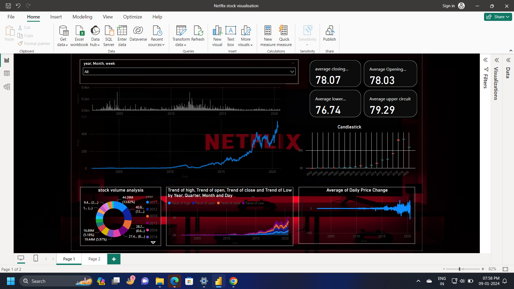

# PowerBI_data_visualisation

# Netflix Stock Data Visualization using Power BI

This project utilizes Power BI to visualize and analyze Netflix stock data from the provided dataset (`netflix.csv`). The dataset includes information about the stock prices and volume from different dates between 2002 and onwards.

## Dataset Overview
The dataset contains the following columns:
- Date: Date of the recorded stock data
- Day: Day of the week
- Week: Week number
- Month: Month of the year
- Year: Year
- Open: Opening stock price
- High: Highest stock price
- Low: Lowest stock price
- Close: Closing stock price
- Adj Close: Adjusted closing stock price
- Volume: Volume of stocks traded

## Visualizations Included

### Key Metrics Cards
- **Average Closing, Opening, Lower Circuit, Upper Circuit:** Utilizing cards to display the average values of these key stock indicators.

### Bar Chart
- **Quantity of Stocks Over Years:** A bar chart showcasing the quantity of Netflix stocks traded over the years.

### Line Chart
- **Stock Price Over Years:** Displaying the trend of stock prices over the years using a line chart.

### Donut Chart
- **Stock Volume Analysis Over the Years:** A donut chart providing insights into stock volume analysis across different years.

### Candlestick Chart
- **Candlestick Chart:** Visual representation of stock data using candlesticks, indicating the open, high, low, and close prices within a specific time frame.

### Line Chart
- **Average Daily Price Change:** Depicting the average daily price change using a line chart to show the trend over time.

### Stacked Area Chart
- **Trend of High, Low, Close, Open Over Time:** Utilizing a stacked area chart to showcase the trends of high, low, close, and open prices over time.

## Slicer Functionality
A slicer functionality has been implemented to allow users to filter and analyze data based on:
- Years
- Months
- Weeks

The slicers provide interactive control to explore the Netflix stock data for specific timeframes, enabling more detailed analysis and insights.

## Visualization

